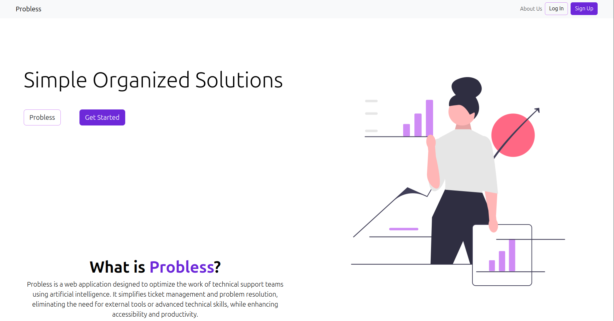
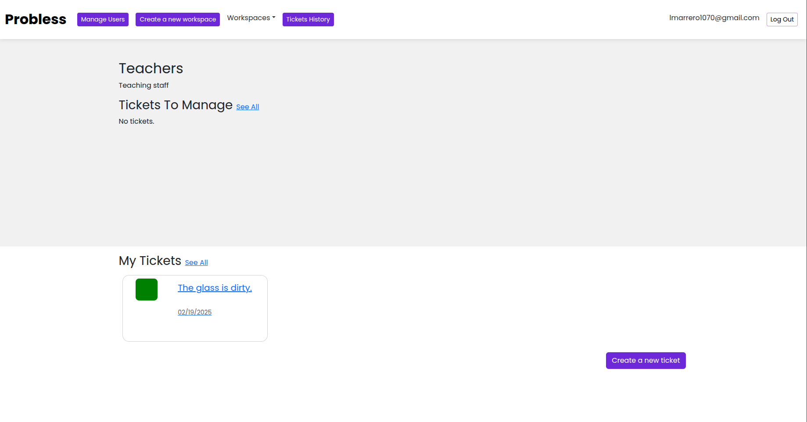

# Probless Project

Probless is a web application for managing tickets, inspired by Jira. It is designed primarily to reduce friction between users and maintenance teams. By leveraging Artificial Intelligence tools, the goal is to make ticket creation and resolution easier than ever before.

All of this is supported by a minimalist and user-friendly interface.

## Stack

- Bootstrap
- Django
- OpenAI API

## Development

### Setup and Installation

```bash
git clone git@github.com:luismarrer/Probless-project.git
cd Probless-project
```

#### Virtual Environment

We will use **pipenv** for managing the virtual environment.

Version used: `pipenv - 2024.0.3`  
[Documentation](https://pipenv.pypa.io/en/latest/)

To install pipenv:

```bash
pip install pipenv
```

With the use of the Pipfile, you only need to run the following commands to initialize the virtual environment with the necessary dependencies:

```bash
pipenv install
pipenv shell
```

Then run the project with:

```bash
cd probless
python manage.py migrate
python manage.py runserver
```

### Disclaimer

>[!WARNING]
>The AI functionalities are comented

## Developers

- [Luis Marrero](https://www.linkedin.com/in/luis-marr/)
- [Michael A. Hernandez](https://www.linkedin.com/in/michael-hern%C3%A1ndez-hern%C3%A1ndez-38a79a1a3/)
- [Danielys Carrasquillo](https://www.linkedin.com/in/danielys-carrasquillo-sierra-8548b028b/)

## Web description

Home page:


The web count with sign up and login form:


You can manage your Workspaces:


your Departments:


the users in each Department for each Workspace:


Create and manage Tickets:




The web count with diferents views depends the user role.

Admin view:


Normal user view:


Interaction with the AI:


## Landing Page

[Probless Landing Page](/)
